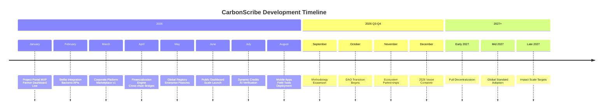

# CarbonScribe: Carbon Credit Tokenization & Real-Time Retirement Platform

CarbonScribe is an end-to-end platform where regenerative agriculture and forestry projects issue carbon credits as Stellar Assets, which corporations can purchase and instantly retire with transparent, on-chain proof. We're building the Internet of Carbon—a digital public utility that transforms ecosystem services into programmable financial assets with real-time environmental telemetry.

## 🌍 The Carbon Market Problem
Current carbon markets are opaque, inefficient, and lack trust:
- **Verification delays**: 6-18 months for credit issuance and verification
- **Opaque pricing**: No real-time price discovery, limited liquidity
- **Double counting risks**: Inadequate global tracking systems
- **High transaction costs**: 30-60% of credit value lost to intermediaries
- **Limited accessibility**: Small projects in developing nations excluded
- **Static credits**: Fixed value regardless of changing environmental conditions

## ✨ CarbonScribe's Solution
Real-time, transparent carbon ecosystem:
- **Instant tokenization**: Convert verified carbon removals to Stellar Assets in minutes
- **Dynamic pricing**: Credit values adjust based on satellite-verified ecosystem health
- **Global interoperability**: Bridges to Verra, Gold Standard, and UN registries
- **Automated compliance**: Built-in regulatory checks for Article 6, CORSIA, CBAM
- **Direct financing**: Forward sales and derivatives for project pre-financing
- **Public transparency**: Every credit and retirement visible on public ledger

## 🏗️ 7-Layer Architecture
### Layer 1: Stellar Blockchain Core
Registry & Settlement Layer - The Trust Foundation:
- `carbon-asset-factory/`: C-01 Token Standard (extended Stellar Asset with environmental metadata)
- `verifiable-registry/`: Hybrid Stellar+IPFS registry with cross-chain bridges
- `compliance-engine/`: Jurisdiction-specific regulatory checks and tax treatment

#### Key Innovations:
- **C-01 Token Standard**: Embedded carbon methodology, vintage, and verification data
- **Time-locked vintages**: Prevent premature credit issuance
- **Buffer pool contracts**: Automated risk mitigation for reversals
- **Immutable retirement ledger**: Global prevention of double counting

### Layer 2: Earth Observation & IoT Verification
Satellite Oracle Network - The Truth Layer:
- `satellite-oracle-network/`: ML processing of Sentinel-2, Planet Labs, and drone data
- `iot-device-network/`: Soil sensors, methane detectors, wildlife cameras with edge computing
- `ground-truth-validation/`: Mobile apps for field verification with validator staking

#### Key Innovations:
- **Multi-source consensus**: Satellite + IoT + ground truth fusion
- **Real-time NDVI tracking**: Vegetation health monitoring every 5 days
- **Automated change detection**: Deforestation alerts within 24 hours
- **Biodiversity proof**: Wildlife camera integration for co-benefit verification

### Layer 3: Project Developer Portal
Farmer & Project Interface - The Creation Layer:
- `frontend/`: Next.js 15 portal for project onboarding, monitoring, and financing
- `backend/`: Go service handling project intake, methodology application, tokenization

#### Key Features:
- **Interactive project mapping**: Time-lapse satellite imagery visualization
- **Automated PDD generation**: Project Design Document creation with AI assistance
- **Forward sale marketplace**: Sell future vintages for upfront financing
- **Real-time monitoring dashboards**: NDVI timelines and alert systems

### Layer 4: Corporate Purchaser Platform
Enterprise Carbon Management - The Retirement Layer:
- `frontend/`: Next.js 15 corporate dashboard for portfolio management and reporting
- `backend/`: NestJS service handling instant retirement, compliance, and marketplace

#### Key Features:
- **One-click retirement**: Instantly retire credits with on-chain proof
- **Automated ESG reporting**: Generate CSRD, GHG Protocol, and SBTi reports
- **Dutch auction marketplace**: Dynamic pricing for carbon credits
- **Impact visualization**: SDG alignment and co-benefit tracking

### Layer 5: Financialization Engine
Carbon Derivatives & Financing - The Liquidity Layer:
- `carbon-derivatives/`: Soroban contracts for futures, options, and stability pools
- `project-financing/`: Go service for credit scoring and deal syndication
- `cross-chain-bridge/`: Rust bridges to Verra, Gold Standard, and Polygon DeFi

#### Key Innovations:
- **Tokenized futures**: Trade future vintages with automated settlement
- **Project credit scoring**: AI-driven assessment of project creditworthiness
- **Cross-registry bridges**: Interoperability with traditional registries
- **Insurance pools**: Community-funded protection against reversals

### Layer 6: Global Registry & Interoperability
Unified Carbon Registry - The Coordination Layer:
- `registry-of-registries/`: Stellar smart contract for global credit ID system
- `api-gateway/`: Go service providing unified GraphQL interface
- `compliance-adapter/`: Python service for regulatory framework integration

#### Key Innovations:
- **Global retirement ledger**: Real-time double counting prevention
- **Unified credit ID**: Cross-registry identifier system
- **Regulatory adapters**: Automated compliance with Article 6, CORSIA, CBAM
- **High-performance caching**: Sub-second query response times

### Layer 7: Public Transparency & Impact Dashboard
Open Data & Visualization - The Trust Layer:
- `public-dashboard/`: Next.js static site with global project visualization
- `data-availability/`: Archiver nodes for permanent data storage on Arweave/IPFS

#### Key Innovations:
- **3D globe visualization**: Interactive Earth with live project data
- **Live retirement ticker**: Real-time display of credit retirements
- **Impact storytelling**: Multimedia narratives from project communities
- **Permanent archiving**: All data stored on decentralized storage networks

## 🚀 Quick Start
### Prerequisites
- Node.js 20+ and npm/yarn/pnpm
- Rust 1.70+ with Cargo (for Soroban contracts)
- Go 1.21+
- Python 3.11+ with geospatial libraries
- Docker and Docker Compose
- Stellar Testnet account with 10,000 XLM test tokens

## 📖 How It Works
### For Project Developers (Farmers & NGOs)
1. **Project Onboarding**: Submit land details and methodology through portal
2. **Satellite Verification**: Automated baseline assessment via satellite data
3. **IoT Deployment**: Install sensors for ground truth validation (optional)
4. **Credit Issuance**: Verified removals tokenized as Stellar Assets
5. **Market Listing**: Credits listed on marketplace with dynamic pricing
6. **Receive Payment**: Instant settlement upon credit sale or retirement

### For Corporate Buyers
1. **Carbon Inventory**: Calculate Scope 1, 2, 3 emissions
2. **Credit Discovery**: Browse marketplace with AI recommendations
3. **Due Diligence**: Review project details, verification data, co-benefits
4. **Purchase & Retirement**: One-click purchase with instant on-chain retirement
5. **Compliance Reporting**: Automated generation of ESG and regulatory reports
6. **Impact Communication**: Share retirement certificates and impact stories

### For Validators & Oracles
- **Stake Tokens**: Deposit tokens to participate in verification network
- **Process Data**: Analyze satellite imagery or operate IoT devices
- **Submit Proofs**: Provide verification data with cryptographic proof
- **Earn Rewards**: Receive fees for accurate verification work
- **Risk Slashing**: Lose stake for malicious or inaccurate submissions

## 💰 Economic Model
### Fee Structure
- **Issuance Fee**: 5% of credit value (covers verification and tokenization)
- **Transaction Fee**: 1% of purchase price (marketplace fee)
- **Retirement Fee**: 0.5% of credit value (covers certificate generation)
- **Verification Fee**: 2% of credit value (distributed to oracle network)

### Revenue Distribution
- 30% to verification oracle network (satellite data, IoT operators, validators)
- 25% to platform development and maintenance
- 20% to buffer pool insurance fund
- 15% to project community development fund
- 10% to CarbonScribe treasury

### CarbonScribe Token (CSC)
- **Total Supply**: 1,000,000,000 tokens
- **Distribution**:
  - 35% Ecosystem incentives (staking, validation, liquidity)
  - 25% Team & advisors (4-year vesting)
  - 20% Foundation treasury
  - 15% Strategic partners
  - 5% Public sale
- **Token Utility**:
  - Governance voting on protocol parameters
  - Fee discounts for token holders
  - Staking for validator roles
  - Access to premium features and data

  ## 🌱 Supported Methodologies
| Methodology Type | Credit Type | Verification Frequency | Co-benefits |
|------------------|-------------|------------------------|-------------|
| Agroforestry | Removal | Quarterly | Biodiversity, soil health, farmer income |
| Improved Forest Management | Avoidance/Removal | Monthly | Watershed protection, habitat conservation |
| Biochar | Removal | One-time with monitoring | Soil amendment, waste utilization |
| Mangrove Restoration | Removal/Blue Carbon | Bi-annual | Coastal protection, fisheries enhancement |
| Soil Carbon | Removal | Annual with spot checks | Water retention, crop yield improvement |
| Renewable Energy | Avoidance | Real-time via IoT | Energy access, health improvements |

## 🛡️ Security & Integrity
### Multi-Layer Verification
- **Satellite Consensus**: 3+ independent satellite data sources
- **IoT Ground Truth**: Soil sensors and field measurements
- **Community Validation**: Local validator network with staked reputation
- **Buffer Pool Protection**: 20% reserve for potential reversals
- **Insurance Backstop**: Third-party insurance for catastrophic events

### Regulatory Compliance
- **Article 6 Ready**: Built-in corresponding adjustment tracking
- **CORSIA Eligible**: Meets ICAO aviation carbon offset requirements
- **CBAM Compatible**: EU Carbon Border Adjustment Mechanism integration
- **CSRD Reporting**: Automated EU Corporate Sustainability Reporting
- **GHG Protocol**: Aligned with global accounting standards

### Transparency Guarantees
- **All data public**: Satellite imagery, verification reports, transactions
- **Real-time tracking**: Live dashboard of all credit issuances and retirements
- **Open source**: Core contracts and verification algorithms publicly auditable
- **Decentralized storage**: Critical data archived on Arweave/IPFS

## 📊 Impact Metrics
### Environmental Impact
- **Carbon Removed**: Target 100M tonnes CO₂e by 2030
- **Biodiversity**: >30% of projects with verified co-benefits
- **Deforestation Prevention**: Real-time alerts protecting 1M+ hectares
- **Community Benefits**: 60% revenue share to local communities

### Market Efficiency
- **Verification Speed**: 90% reduction vs. traditional processes (days vs. months)
- **Transaction Cost**: 80% reduction in intermediary fees
- **Liquidity**: 24/7 global trading with transparent pricing
- **Accessibility**: 10x more small projects able to participate

### Technology Performance
- **Satellite Refresh**: Every 5 days (Sentinel-2)
- **Verification Confidence**: >95% accuracy via multi-source consensus
- **Transaction Finality**: <5 seconds on Stellar network
- **System Uptime**: 99.9% target with decentralized architecture

## 🤝 Partnerships & Integrations
### Registry Partnerships
- **Verra**: Bridge for VCU tokenization
- **Gold Standard**: GS-certified project integration
- **American Carbon Registry**: US-focused methodologies
- **UNFCCC**: Article 6 corresponding adjustment tracking

### Technology Partners
- **Planet Labs**: Daily satellite imagery
- **Sentinel Hub**: Earth observation data processing
- **Arweave**: Permanent data storage
- **Chainlink**: Oracle services for external data

### Implementation Partners
- **World Bank**: FCPF program integration
- **UN-REDD**: Forest conservation projects
- **Conservation International**: Biodiversity-focused methodologies
- **Farmers' Organizations**: Local implementation networks

## 🗺️ Development Roadmap

### Phase 1: Foundation & MVP (Q3-Q4 2024) ✅ **COMPLETED**
**Status**: Core infrastructure implemented, Farmer Portal Live

#### ✅ Completed Components:
- **Project Portal Frontend** (Layer 3): Complete farmer dashboard with:
  - Project management system (CRUD operations, filtering, search)
  - Real-time monitoring dashboard (satellite insights, alerts)
  - Financing module (credit tokenization status, revenue tracking)
  - Team management interface
  - Document management system
  - Settings & configuration panel
- **UI/UX Foundation**: 
  - Design system with Tailwind CSS v4
  - Responsive layouts (mobile-first approach)
  - Component library with consistent patterns
  - Custom animations and transitions
- **Frontend Architecture**:
  - Next.js 15 App Router implementation
  - TypeScript with full type safety
  - Context API for state management
  - Modular component architecture

#### 🎯 Current Status: 
Farmer-facing portal is fully operational with mock data. Ready for backend integration and blockchain connectivity.

---

### Phase 2: Backend Integration & Blockchain Layer (Q1 2025)
**Focus**: Connect frontend to Stellar blockchain and backend services

#### 🔄 In Progress / Next Steps:
1. **Stellar Integration** (Layer 1)
   - [ ] Stellar SDK integration for wallet connectivity
   - [ ] Soroban smart contract interactions
   - [ ] C-01 Token Standard implementation
   - [ ] Carbon asset minting and transfer functions
   - [ ] On-chain retirement verification

2. **Backend Services** (Layer 3 Backend - Go)
   - [ ] Project onboarding API endpoints
   - [ ] Document management with IPFS integration
   - [ ] Credit tokenization workflow
   - [ ] Farmer authentication and authorization
   - [ ] Real-time data synchronization

3. **Satellite Data Integration** (Layer 2)
   - [ ] Sentinel-2 API integration
   - [ ] NDVI calculation service
   - [ ] Real-time vegetation monitoring
   - [ ] Automated alert system

#### 📊 Milestones:
- **M1.1**: Connect to Stellar testnet, mint test carbon credits
- **M1.2**: Implement project CRUD with Go backend
- **M1.3**: Integrate satellite data feeds
- **M1.4**: Deploy to Staging environment

---

### Phase 3: Corporate Platform & Marketplace (Q2 2025)
**Focus**: Build corporate buyer interface and marketplace functionality

#### 🎯 Planned Components:
1. **Corporate Platform** (Layer 4)
   - [ ] Corporate dashboard for credit purchasing
   - [ ] One-click retirement interface
   - [ ] ESG reporting automation
   - [ ] Portfolio management tools
   - [ ] Compliance document generation

2. **Marketplace Engine**
   - [ ] Credit discovery and search
   - [ ] Dutch auction mechanism
   - [ ] Real-time price discovery
   - [ ] Credit recommendation AI
   - [ ] Corporate onboarding flow

3. **Advanced Features**
   - [ ] Forward sale agreements
   - [ ] Credit bundling options
   - [ ] API access for enterprise integration
   - [ ] Bulk purchasing interface

#### 📊 Milestones:
- **M2.1**: Corporate platform MVP launch
- **M2.2**: First corporate pilot programs
- **M2.3**: Marketplace with basic auction functionality
- **M2.4**: Integration with major registries (Verra bridge)

---

### Phase 4: Financialization & Advanced Features (Q3 2025)
**Focus**: Implement financial instruments and cross-chain capabilities

#### 🎯 Planned Components:
1. **Financialization Engine** (Layer 5)
   - [ ] Carbon credit futures contracts
   - [ ] Options trading platform
   - [ ] Project financing mechanisms
   - [ ] Credit scoring algorithms
   - [ ] Insurance pool implementation

2. **Cross-Chain Integration**
   - [ ] Verra registry bridge (soroban/)
   - [ ] Gold Standard bridge
   - [ ] Polygon/Ethereum DeFi integration
   - [ ] IBC/CCIP implementation

3. **Dynamic Carbon Credits**
   - [ ] Real-time value adjustment algorithms
   - [ ] Environmental condition tracking
   - [ ] Automated buffer pool adjustments
   - [ ] Risk assessment models

#### 📊 Milestones:
- **M3.1**: Launch carbon derivatives platform
- **M3.2**: Cross-chain bridge to Verra
- **M3.3**: Dynamic credit valuation v1
- **M3.4**: Institutional investor onboarding

---

### Phase 5: Global Registry & Scale (Q4 2025)
**Focus**: Deploy global registry and achieve enterprise scale

#### 🎯 Planned Components:
1. **Global Registry** (Layer 6)
   - [ ] Registry-of-registries smart contract
   - [ ] Unified credit ID system
   - [ ] Global double counting prevention
   - [ ] High-performance API gateway
   - [ ] Regulatory adapter framework

2. **Enterprise Features**
   - [ ] Multi-tenant architecture
   - [ ] SSO and enterprise auth
   - [ ] Advanced reporting suite
   - [ ] Audit trail system
   - [ ] SLA guarantees

3. **Public Transparency** (Layer 7)
   - [ ] Global impact dashboard
   - [ ] Real-time retirement ticker
   - [ ] 3D globe visualization
   - [ ] Data availability layer
   - [ ] Public API access

#### 📊 Milestones:
- **M4.1**: Global registry mainnet launch
- **M4.2**: Enterprise customer deployment
- **M4.3**: Public transparency dashboard
- **M4.4**: 100+ projects onboarded

---

### Phase 6: Ecosystem Expansion & AI Integration (2026)
**Focus**: Expand methodology coverage and integrate advanced AI

#### 🎯 Planned Components:
1. **2026 Twist: Dynamic Carbon Credits**
   - [ ] Real-time satellite value updates
   - [ ] Forest growth tracking algorithms
   - [ ] Drought condition impact modeling
   - [ ] Automated risk adjustment
   - [ ] Predictive analytics for credit valuation

2. **AI & Machine Learning**
   - [ ] AI-powered project verification
   - [ ] Predictive deforestation alerts
   - [ ] Automated methodology matching
   - [ ] Credit price forecasting
   - [ ] Anomaly detection systems

3. **Ecosystem Expansion**
   - [ ] Blue carbon methodologies
   - [ ] Urban carbon projects
   - [ ] Industrial carbon capture
   - [ ] Carbon removal technologies
   - [ ] Biodiversity credit integration

4. **Mobile & Field Applications**
   - [ ] Offline-first mobile apps
   - [ ] Drone data integration
   - [ ] Field sensor networks
   - [ ] Community validation tools
   - [ ] Local language support

#### 📊 Milestones:
- **M5.1**: Dynamic carbon credits live on mainnet
- **M5.2**: AI verification system deployment
- **M5.3**: Mobile app launch for field teams
- **M5.4**: 1,000+ projects across 50+ countries

---

### Phase 7: Global Impact & Decentralization (2027+)
**Focus**: Achieve platform decentralization and global scale impact

#### 🎯 Long-term Vision:
1. **Full Decentralization**
   - [ ] DAO governance implementation
   - [ ] Validator network expansion
   - [ ] Protocol-owned liquidity
   - [ ] Community-driven development
   - [ ] Open source ecosystem

2. **Global Standards**
   - [ ] ISO certification for methodologies
   - [ ] UNFCCC recognition
   - [ ] Industry standard adoption
   - [ ] Regulatory framework contributions
   - [ ] Academic research partnerships

3. **Impact Targets**
   - [ ] 1 billion tonnes CO₂e tokenized
   - [ ] $10B+ in project financing
   - [ ] 10,000+ projects globally
   - [ ] 1M+ hectares protected
   - [ ] 500K+ livelihoods improved

4. **Technology Evolution**
   - [ ] Quantum-resistant cryptography
   - [ ] Advanced satellite constellations
   - [ ] IoT sensor networks expansion
   - [ ] Interplanetary file system integration
   - [ ] Carbon metaverse integration

#### 📊 Ultimate Goals:
- **Vision**: Become the global standard for transparent carbon markets
- **Mission**: Make high-quality carbon credits accessible to all projects
- **Impact**: Significant contribution to global climate goals
- **Innovation**: Continuous advancement in environmental fintech

---

## 🔄 Current Development Status

### ✅ Completed (Phase 1)
- **Farmer Portal Frontend**: 100%
- **UI/UX Design System**: 100%
- **Component Library**: 100%
- **Mock Data Integration**: 100%
- **Responsive Design**: 100%

### 🔄 In Progress (Phase 2)
- **Stellar Integration**: 0%
- **Backend API Development**: 0%
- **Satellite Data Integration**: 0%
- **Authentication System**: 0%

### 📅 Upcoming (Phase 2-3)
- **Corporate Platform**: 0%
- **Marketplace Engine**: 0%
- **Financialization Features**: 0%
- **Cross-Chain Bridges**: 0%

### 📊 Overall Progress: 10%
*Based on completed frontend vs. full 7-layer architecture implementation*

---

## 🎯 Key Technical Milestones Timeline

---
**CarbonScribe**: Making every ton of carbon count. Transparent, verifiable, and accessible to all.